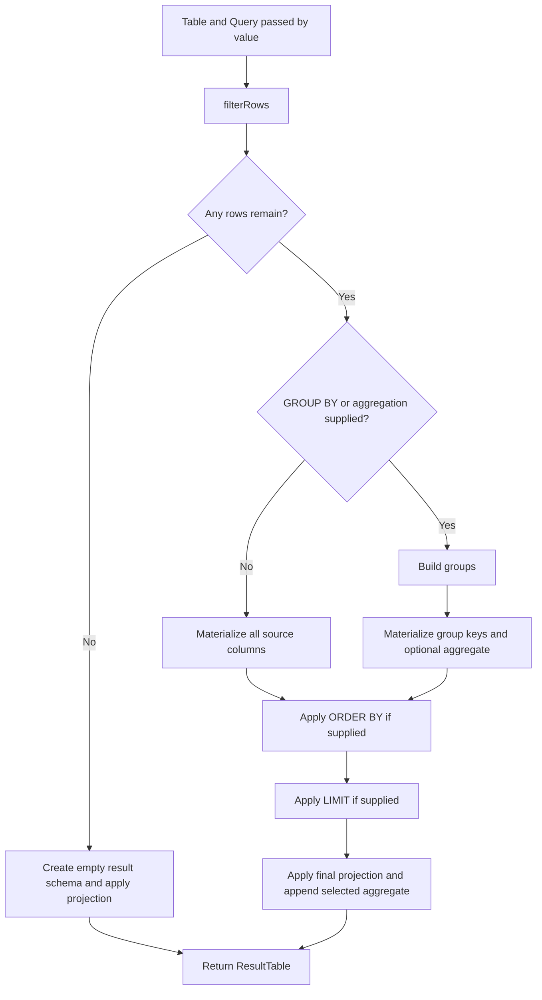

# Query Engine Design and Workflow

This guide describes the implementation on the `main` branch, reviewed on
3 October 2026. It explains the current behavior and tradeoffs rather than a
future database architecture. See the [roadmap](roadmap.md) for planned work and
the [benchmark design guide](benchmark-design.md) for measurement mechanics.

## Purpose and boundaries

The engine is a small, in-memory C++20 library for learning query execution and
measuring optimizations. It operates on one fixed sales schema. A caller builds
a `Query` object, passes it and a `Table` to `queryTable()`, and receives a
`ResultTable`.

There is no SQL parser, query planner, persistent storage, transaction system,
or network service. SQL examples describe query intent; the executable input
is C++ objects.

The current implementation favors visible execution stages and ordinary
standard-library containers. Its copies and intermediate tables also provide
measurable targets for later optimization experiments. This makes a useful
learning baseline, but its implementation should not be read as a recommended
production database design.

## Code organization

| Location | Responsibility |
| --- | --- |
| `include/query_engine/table.hpp` | Source rows, result values, tables, and groups |
| `include/query_engine/query.hpp` | Query clauses, ordering expressions, and public execution API |
| `include/query_engine/aggregation.hpp` | Aggregate types and public aggregation API |
| `include/query_engine/query_engine.hpp` | Convenience header for library consumers |
| `src/table.cpp` | Data generation and column access |
| `src/query.cpp` | Filtering, grouping, result construction, ordering, limits, and projection |
| `src/aggregation.cpp` | Numeric aggregate calculations |
| `src/formatter.cpp` | Conversion to printable cells and ASCII table output |
| `examples/` | Sample application |
| `tests/` | Correctness executables |
| `benchmarks/` | Performance workloads and general reporter |

CMake builds the implementation into the `query_engine` library. Examples,
tests, and benchmarks link to it. Public headers are included with the
`query_engine/` prefix. Some execution helpers remain internal implementation
details in `query.cpp`, although they are not all given internal linkage.

## Data and query representations

### Fixed source rows

`Row` has six numeric fields. `Table` stores them in `std::vector<Row>` and
keeps a separate list of source column identifiers.

This row-store layout makes insertion and whole-row access straightforward.
The schema is explicit, and contiguous rows are easy to inspect. Analytical
queries that need only one field still traverse the full row layout, which can
increase memory traffic compared with a column store.

The column list is metadata, not a schema validator. Callers constructing a
`Table` must keep it consistent with the fixed fields and the query's needs.

### C++ query objects

`Query` contains a projection vector and optional filter, aggregation,
grouping, ordering, and limit clauses. `std::optional` distinguishes an absent
clause from a supplied value, including `LIMIT 0`.

The filter is `std::function<bool(Row)>`. Callers can supply lambdas with
arbitrary conditions or captured parameters. This is convenient and flexible,
but predicates are opaque to the engine: it cannot inspect them to choose an
index or rewrite expressions. The signature also passes each row by value and
uses type-erased function dispatch.

Grouping takes a vector of column identifiers. Ordering takes a vector of
`OrderByItem`, each with its own direction and an expression represented as
`std::variant<ColumnName, Aggregation>`.

Only one aggregate can be selected. Projection selects source columns, and the
aggregate is appended automatically; there is no unified SELECT-expression
list supporting arbitrary mixtures, aliases, or multiple aggregates.

### Dynamic result rows

`ResultValue` is a variant of the four numeric types used by the source schema.
`ResultRow` stores a vector of these values, and `ResultTable` stores a vector
of rows alongside string column names.

This permits different result widths without defining a new C++ row type for
each query. It also preserves numeric types. The costs are per-row allocation,
variant handling, and maintaining schema information separately from values.
The implementation does not enforce that every row has exactly as many values
as the result has column names.

## Execution workflow

The public entry point takes its inputs by value:

```cpp
ResultTable queryTable(Table table, Query query);
```

Passing existing lvalues copies the table and query before execution starts.
Several helpers then take vectors and rows by value, causing additional copies.

The main execution path is:



### 1. Filter input

`filterRows()` scans the input when a predicate exists and copies matching rows
into a new vector. Without a predicate, it returns its row vector directly.

Keeping filtering separate makes the selected input easy to inspect and reuse
for either detail or aggregate queries. Materializing that input consumes
memory and requires subsequent stages to scan it again.

If no rows remain, `queryTable()` returns early. It creates result metadata and
applies projection, but does not execute aggregation. Thus a scalar aggregate
query on empty input returns zero rows, unlike a nonempty scalar aggregate
query, which returns one row.

### 2. Choose the output row granularity

For a query without grouping or aggregation, each filtered source row becomes
one intermediate result row. Every column in `Table::column_names` is
materialized, even when the final projection requests only one column.

When grouping or aggregation is present, the engine creates groups:

- With GROUP BY, each distinct composite key produces one group.
- With aggregation and no GROUP BY, all filtered rows form one group.
- With GROUP BY and no aggregation, the result contains one row per key.

These paths make the distinction between detail rows and group rows explicit.
A single ungrouped container does not imply a single output row unless an
aggregate operation is requested.

### 3. Build groups and aggregate

A `Group` stores its key columns, a vector of variant key values, and complete
source rows. For each input row, the engine builds a key and searches the vector
of existing groups for a match.

This supports multiple numeric grouping columns without a custom hash function.
It also allows existing aggregate functions to run on each group's rows.
However, grouping takes roughly `O(N * G)` key searches for `N` rows and `G`
groups, with additional cost for wider keys. Unique keys can make it quadratic.
It also retains full rows and rescans them during aggregation.

Aggregate functions implement COUNT, SUM, AVG, MIN, and MAX. SUM and the extrema
convert source values to `double`; COUNT returns an integer. AVG calculates SUM
and COUNT separately, with repeated scans and vector copies. Converting large
integers to `double` can lose precision.

### 4. Sort before final projection

`applyOrderBy()` calls `std::sort` with a comparator over intermediate result
rows. It visits order expressions in sequence, so later expressions break ties
from earlier ones. Each expression has an independent ascending or descending
direction.

Expressions are matched to result columns by their string names. This is simple
and supports sorting by the selected aggregate, but the comparator repeatedly
builds expression names and searches metadata during comparisons.

Delaying projection preserves ordinary source columns for hidden sorting. In
grouped results it preserves group keys, including keys omitted from projection.
Only the selected aggregate is materialized: a different aggregate mentioned
only in ORDER BY is not calculated. Unavailable ordering expressions are
silently skipped.

`std::variant` comparisons compare alternative indexes when the alternatives
differ. For valid results, values within a given column normally have the same
alternative. This comparator is not a general mixed-numeric-value comparator.
There is no explicit NaN ordering policy. Sorting is not stable, so rows equal
under all order expressions have no guaranteed relative order.

### 5. Limit output

`applyLimit()` removes rows from the end until the requested size is reached.
It runs after aggregation and sorting and before final projection. Zero is a
valid limit, and an oversized limit leaves the result unchanged.

This implementation is easy to follow but does not reduce upstream work. A
small limit still allows all rows to be materialized and, when ordering is
requested, fully sorted. Top-K sorting and early termination are future
optimizations with query-dependent applicability.

### 6. Project final columns

`applyProjection()` builds a new result vector in the order of
`Query::projection`, then appends the selected aggregate if present. It replaces
the intermediate column names with final names.

Projection removes hidden sorting values and keeps query output order separate
from intermediate layout. It also copies result rows and repeatedly looks up
column names. A requested column missing from the intermediate schema is
skipped when copying values, but still added to output metadata; invalid query
combinations can therefore produce mismatched row and schema widths.

## Insertion and formatting

`insertRow()` appends a `Row` to the table vector. It is a minimal insertion API
without key constraints, indexes, transactions, or schema validation.

The formatter overloads `printSqlTable()` for source and result tables. Both
convert values to strings before calling the shared ASCII-table renderer.
Column widths are computed from the rendered contents, and doubles display two
decimal places. This formatting rounds presentation only; it does not change
stored results. Formatting allocates strings and buffers and sits outside the
timed query benchmarks.

## Advantages of the current design

- Execution stages are visible and can be examined independently.
- Standard-library containers keep ownership and cleanup understandable.
- C++ query objects make it possible to exercise execution without a parser.
- Numeric variants permit different output schemas while preserving types.
- Late projection supports hidden sorting values with a straightforward flow.
- Separate correctness tests and benchmarks allow behavior and cost to be
  evaluated independently.
- Copies, scans, grouping searches, and allocations provide distinct targets
  for measured optimization experiments.

## Current limitations and correctness boundaries

The main limitations are broader than performance:

- There is no central validation of query combinations or schema consistency.
- Empty scalar queries bypass aggregation; their contract needs explicit tests.
- Direct empty MIN and MAX return zero. Direct empty AVG divides zero by zero
  without a dedicated empty-input branch.
- Only one selected aggregate exists; order-only aggregates are unavailable.
- Projection cannot express computed values, aliases, nulls, or strings.
- Grouping is based on linear searches and complete-row storage.
- Floating-point and large-integer edge cases lack comprehensive policies.
- Generated timestamps depend on the system clock, although other generated
  values follow predictable formulas.
- Some test areas remain thin: the dedicated group-by executable prints results
  without assertions, and benchmark checks focus on row counts rather than
  complete result contents.

Passing the current test suite establishes the covered behavior. It does not
establish SQL compatibility or correctness for every possible `Query` object.

## Extending the engine

Choose explicit result contracts and add focused tests before changing behavior.
For performance experiments, retain the reference revision and compare the same
workloads against fresh local measurements. Removing unnecessary parameter
copies is a small initial experiment; fusing execution, maintaining aggregate
states, hash grouping, top-K selection, and column storage change progressively
more of the architecture.

Any experiment must preserve the chosen query semantics and output schema.
Development happens on `main` or feature branches; the separate `baseline`
branch provides the reference implementation for performance comparisons.
Use the [branch comparison workflow](benchmarks.md#baseline-branch) and the
[interpretation guide](benchmark-interpretation.md) to evaluate its effect.
